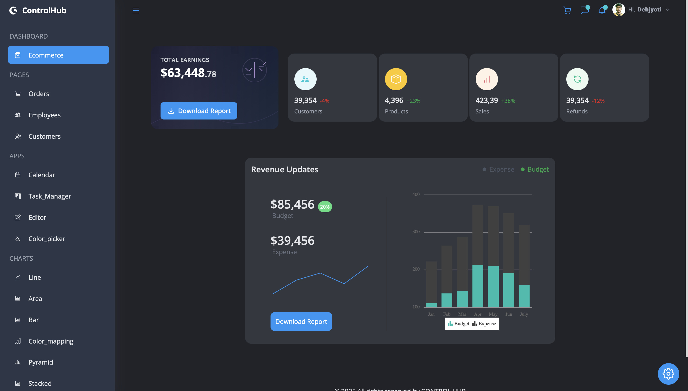

# Modern Admin Dashboard with React & Syncfusion 🚀

A feature-rich admin dashboard application built with React and Syncfusion components, offering comprehensive data visualization, business analytics, and project management capabilities.

## 🌐 Live Demo
[Experience the Dashboard](https://control-hub.vercel.app/)



## ⚡ Key Features

### 📊 Dashboard
Interactive dashboard with real-time analytics and comprehensive ecommerce data visualization:
- Sales metrics
- Revenue analytics
- Customer insights
- Inventory tracking
- Growth indicators

### 📑 Pages
Efficiently manage your business operations with dedicated pages:

#### Orders
- Comprehensive order management system
- Real-time order tracking
- Status updates
- Order history
- Customer details

#### Employees
- Employee directory
- Role management
- Performance tracking
- Contact information
- Department organization

#### Customers
- Customer profiles
- Purchase history
- Interaction tracking
- Analytics
- Communication logs

### 💼 Applications

#### Calendar
- Event management
- Schedule visualization
- Team coordination
- Reminder system
- Meeting planning

#### Kanban Board
- Visual task management
- Team collaboration
- Progress tracking
- Priority management
- Deadline monitoring

#### Rich Text Editor
- Document creation
- Content formatting
- File management
- Collaboration tools
- Export capabilities

#### Color Picker
- Custom color selection
- RGB/HSL values
- Color palette management
- Theme customization
- Brand color consistency

### 📈 Charts
Advanced data visualization powered by Syncfusion:

- **Line Charts**: Track trends and patterns
- **Area Charts**: Visualize data volumes
- **Bar Charts**: Compare data sets
- **Color Mapping**: Geographic data visualization
- **Pyramid Charts**: Hierarchical data representation
- **Stacked Charts**: Multi-layer data analysis

## 🛠️ Built With
- **React**: Frontend framework
- **Syncfusion**: UI components
- **JavaScript (ES6+)**: Programming language
- **TAILWIND**: Styling with modern features
- **Vite**: Build tool

## ⚙️ Installation

1. Clone the repository
```bash
git clone https://github.com/Debjyoti2004/ControlHub.git
```

2. Navigate to project directory
```bash
cd admin-dashboard
```

3. Install dependencies
```bash
npm install
```

4. Start the development server
```bash
npm run dev
```

5. Build for production
```bash
npm run build
```

## 📱 Responsive Design
Optimized for all devices:
- 💻 Desktop
- 📱 Mobile
- 📟 Tablet

## 🎨 Theme Options
- Light & Dark mode
- Customizable color schemes
- Responsive navigation


## 📂 Project Structure
```
src/
├── components/
│   ├── Dashboard/
│   ├── Pages/
│   │   ├── Orders/
│   │   ├── Employees/
│   │   └── Customers/
│   ├── Apps/
│   │   ├── Calendar/
│   │   ├── Kanban/
│   │   ├── Editor/
│   │   └── ColorPicker/
│   └── Charts/
├── data/
├── contexts/
└── App.jsx
```

## 📝 License
This project is licensed under the MIT License - see the [LICENSE](LICENSE) file for details.

## 📧 Contact
Your Name - Debjyoti Shit
Your Name - [debjyotishit27@gmail.com](mailto:debjyotishit27@gmail.com)


---
### Built with 💙 using React & Syncfusion
